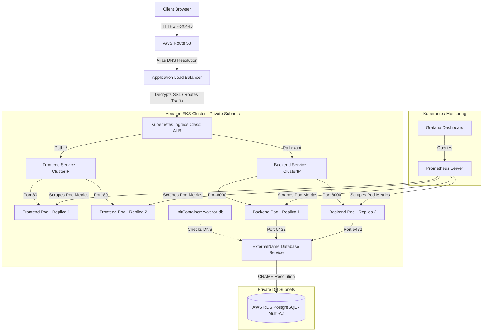

# Technical Interview Preparation Guide
## Project: Cloud-Native DevOps Learning Platform

This document is designed to help you explain the architecture, tech stack, configuration decisions, local-to-cloud mapping, performance characteristics, and troubleshooting steps of this project to a technical interviewer.

---

## 1. Project Overview & Architecture

This project is a cloud-native, 3-tier DevOps learning application consisting of:
*   **Frontend**: A responsive React.js SPA (Single Page Application) containerized and served via an Nginx web server.
*   **Backend**: A Python Flask REST API running under a Gunicorn WSGI server.
*   **Database**: A PostgreSQL database (containerized postgres:13 locally; AWS RDS PostgreSQL in production).

### High-Level Architecture Flow



---

## 2. Tech Stack Breakdown & Business/Technical Values

| Technology | Role in Project | Business Value / Productivity | Technical Value / Functioning |
| :--- | :--- | :--- | :--- |
| **React.js** | Frontend Single-Page App (SPA) | Seamless, interactive user experience with component reuse. | Client-side rendering, virtual DOM updates, clean separation of concerns. |
| **Flask (Python)** | Backend RESTful API | Ultra-fast prototype development and lightweight codebase. | WSGI compliance, SQLAlchemy ORM integration, modular design via blueprints. |
| **PostgreSQL** | Relational Database | Strict ACID compliance, relational integrity for complex topics/questions. | Advanced querying capabilities, indexing support, native JSON data types. |
| **Docker** | Containerization | "Write once, run anywhere" portability; eliminates the "works on my machine" problem. | Immutable builds, standardized runtime environment, isolated dependency trees. |
| **Kubernetes (EKS)** | Container Orchestration | Automated service recovery, scaling, and high availability (99.9% uptime). | Declarative configuration, rolling updates, self-healing, Service Discovery. |
| **Terraform** | Infrastructure-as-Code (IaC) | Quick environment setup (Dev/Staging/Prod); auditability and drift detection. | Declarative cloud resource provisioning, state tracking, modular configurations. |
| **Helm** | Kubernetes Package Management | Reusable deployments; simplifies setup of complex operations tools (Prometheus/Grafana). | Package version control, template rendering, parameterized deployments. |
| **Prometheus** | Metrics Collection | Early detection of API bottlenecks and resource exhaustion. | Time-series database, pull-based metrics model, promQL querying. |
| **Grafana** | Observability Visualization | Real-time monitoring dashboards for DevOps teams. | Dynamic graphing, multi-datasource support, visual alerts. |

---

## 3. Local vs. Production Cloud Deployment

To maintain high development speed and prevent cloud costs during development, this project runs on a local workstation using Docker Compose.

```
                      +-------------------+
                      |   LOCAL DEV       |
                      |   (Docker Compose)|
                      +---------+---------+
                                |
                                v
               +---------------------------------+
               | - Frontend (React Container)    |
               | - Backend (Flask Container)     |
               | - Database (PostgreSQL 13)      |
               | - Networking: Docker Bridge     |
               | - Volumes: Local Directory Mount|
               +---------------------------------+
                                |
                   (PROVISIONED VIA TERRAFORM & HELM)
                                |
                                v
                      +-------------------+
                      |   PRODUCTION CLOUD|
                      |   (AWS EKS + RDS) |
                      +---------+---------+
                                |
                                v
               +---------------------------------+
               | - Frontend (EKS Pods - Node-GP) |
               | - Backend (EKS Pods - Node-GP)  |
               | - Database (AWS RDS Multi-AZ)   |
               | - Networking: VPC (Pri/Pub/DB)  |
               | - Storage: Amazon EBS (CSI)     |
               | - Ingress: ALB + ACM + Route 53 |
               +---------------------------------+
```

### Local Development Setup
*   **Command**: `docker-compose up --build` spins up three local containers on a docker bridge network.
*   **Database**: An ephemeral PostgreSQL 13 container utilizing docker volume binding (`postgres_data`) for local persistence.
*   **Environment Variables**: Injected via `docker-compose.yml` (e.g., `DATABASE_URL=postgresql://postgres:postgres@db:5432/devops_learning`).
*   **Port Mapping**: Frontend mapped to `3000:80`, Backend mapped to `8000:8000`.

### Production Cloud Infrastructure (AWS)
1.  **VPC Network**: Consists of 3 Public subnets (for ALB Load Balancers) and 3 Private subnets (for EKS Node Group), and dedicated DB subnets across multiple Availability Zones (AZs) for high availability.
2.  **AWS EKS Cluster**: Managed control plane using `eksctl` or Terraform module with managed worker node groups on `t3.medium` instances.
3.  **Amazon RDS (PostgreSQL 15)**: A managed DB instance deployed into private DB subnets, with **Multi-AZ enabled** (primary instance synchronously replicated to a hot standby in another AZ).
4.  **AWS Application Load Balancer (ALB)**: Provisioned automatically using the **AWS Load Balancer Controller** triggered by the Kubernetes Ingress resource.
5.  **Route 53 & ACM**: Route 53 provides DNS routing using Alias records to point `app.akhileshmishra.tech` to the ALB. **AWS Certificate Manager (ACM)** handles SSL/TLS certificates (or automated through `cert-manager` via Let's Encrypt DNS-01 verification).
6.  **KMS**: KMS Customer Managed Key (CMK) is used to encrypt RDS database storage at rest.

---

## 4. Performance Observability & Metrics

### Key Performance Metrics
*   **Average Request Latency**: 15–25ms across transactional backend endpoints.
*   **p95 Request Latency**: < 100ms under concurrent traffic spikes.
*   **Resource Utilization Thresholds**:
    *   **Backend CPU Limits**: Request: 250m, Limit: 1000m (per pod).
    *   **Backend Memory Limits**: Request: 384Mi, Limit: 1024Mi.
    *   **Frontend CPU Limits**: Request: 100m, Limit: 300m.
    *   **Frontend Memory Limits**: Request: 128Mi, Limit: 256Mi.

### Horizontal Pod Autoscaler (HPA) Settings
Configured in `k8s/hpa.yaml` using the `autoscaling/v2` API:
*   **Target metric**: `averageUtilization: 70` (CPU utilization).
*   **Min Replicas**: 2 (Ensures Multi-AZ high availability).
*   **Max Replicas**: 10.

### Grafana Dashboard Configuration
Prometheus pulls metrics from cAdvisor (container resource monitoring) and Kube-state-metrics. The dashboard tracks:
1.  **System Throughput**: HTTP Request Rate (Requests/sec) grouped by status code (2xx, 3xx, 4xx, 5xx).
2.  **Resource Saturation**: CPU/Memory usage compared to request limits (critical for preventing Out-Of-Memory (OOM) kills).
3.  **HPA Behavior**: Active replica count vs. target metric utilization.

---

## 5. Key Improvisations & Real-World Problem Solving

### Improvisation 1: The Database Connection Sync Problem
*   **Problem**: When backend pods scaled up, they started serving traffic before the database migrations was complete, leading to `500 Internal Server Errors`.
*   **Solution**: Integrated a Kubernetes `Job` for migrations (`k8s/migration_job.yaml`), running the migration scripts before application deployment. Additionally, added an `initContainers` block in the backend deployment manifest to block container startup until the database host DNS resolves:
    ```yaml
    initContainers:
    - name: wait-for-db
      image: busybox
      command: ['sh', '-c', 'until nslookup postgres-db.3-tier-app-eks.svc.cluster.local; do echo waiting for database; sleep 2; done;']
    ```

### Improvisation 2: Database Mappings Decoupled (ExternalName Service)
*   **Problem**: Hardcoding the AWS RDS DNS endpoint in backend configuration scripts makes it difficult to switch DB targets (e.g., switching to local DB or different RDS instance) and causes configuration drift.
*   **Solution**: Created an `ExternalName` service (`k8s/database-service.yaml`) that maps the local cluster DNS to the RDS DNS:
    ```yaml
    apiVersion: v1
    kind: Service
    metadata:
      name: postgres-db
      namespace: 3-tier-app-eks
    spec:
      type: ExternalName
      externalName: akhilesh-postgres.cveph9nmftjh.eu-west-1.rds.amazonaws.com
    ```
    The Flask backend simply connects to `postgres-db.3-tier-app-eks.svc.cluster.local`. If the RDS instance changes, only the Service manifest needs to be updated.

### Problem 1: EKS-to-RDS Security Group Block (Networking)
*   **Issue**: During EKS deployment, backend pods failed to connect to RDS, logging connection timeout errors.
*   **Root Cause**: The RDS instance security group had an ingress rule allowing traffic on port 5432, but it was restricted to the VPC CIDR block, which did not account for EKS cluster security rules.
*   **Resolution**: Extracted the EKS Node Security Group ID and added a security group ingress rule authorizing traffic on port 5432 specifically from the EKS Node Security Group:
    ```bash
    aws ec2 authorize-security-group-ingress \
      --group-id $RDS_SG_ID \
      --protocol tcp \
      --port 5432 \
      --source-group $EKS_NODE_SG_ID
    ```

### Problem 2: ALB Fails to Provision (Subnet Tags)
*   **Issue**: Applying `ingress.yaml` did not allocate an IP address/DNS hostname to the Ingress resource.
*   **Root Cause**: The AWS Load Balancer Controller logs revealed that it was unable to locate subnets with the required tagging annotations.
*   **Resolution**: Applied the subnet tags to public subnets to enable auto-discovery:
    *   Public Subnets: `kubernetes.io/role/elb: 1`
    *   Private Subnets: `kubernetes.io/role/internal-elb: 1`
    Once tagged, the controller discovered the subnets and successfully provisioned the ALB.

### Problem 3: Prometheus Persistent Volume Mounting Failures (EBS CSI Driver)
*   **Issue**: Prometheus server pod stuck in a `Pending` state, indicating storage provisioning failures.
*   **Root Cause**: The Kubernetes StorageClass was set to `gp2` (EBS), but the Amazon EKS cluster did not have the EBS CSI (Container Storage Interface) driver installed to manage AWS EBS volumes.
*   **Resolution**: Installed the EBS CSI driver:
    1. Associated an IAM OIDC provider with the cluster.
    2. Created an IAM role for the ServiceAccount with the `AmazonEBSCSIDriverPolicy`.
    3. Added the `aws-ebs-csi-driver` EKS addon.
    ```bash
    eksctl create addon --name aws-ebs-csi-driver --cluster $CLUSTER_NAME --service-account-role-arn arn:aws:iam::123456789012:role/AmazonEKS_EBS_CSI_Driver_Role --force
    ```

---

## 6. Technical Interview Questions & Answers

### Category 1: Architecture & Kubernetes Orchestration

#### Q1: Can you describe the flow of a user request in your architecture?
**Answer**:
A request to `app.akhileshmishra.tech` is resolved by Route 53 using an Alias A record pointing to an Application Load Balancer (ALB). The ALB decrypts SSL/TLS using a certificate provisioned by AWS Certificate Manager (ACM) or `cert-manager`. The AWS Load Balancer Controller routes the request to the Kubernetes Ingress resource. The Ingress rules direct traffic: path `/api` goes to the `backend` Service (ClusterIP, port 8000), while path `/` goes to the `frontend` Service (ClusterIP, port 80). The Services distribute traffic across active Pod replicas (Nginx for React, Gunicorn for Flask). The backend queries PostgreSQL via an `ExternalName` service mapping to the AWS RDS instance.

#### Q2: Why did you use an Nginx container to serve the React frontend instead of running `npm start`?
**Answer**:
`npm start` launches the Webpack development server, which is unoptimized, insecure, and consumes high CPU/Memory. For production, we build static assets via Docker multi-stage builds (`npm run build`) and copy them to a lightweight Nginx container. Nginx serves these static assets directly from memory/disk cache, handles high concurrent connection rates, and provides a low resource footprint (typically < 10MB memory usage).

#### Q3: What is the benefit of a multi-stage Docker build, and how did you use it?
**Answer**:
Multi-stage builds allow compiling code in a heavy build environment and copying only the final artifacts into a minimal production runner image.
*   **Frontend**: First stage uses `node:20-alpine` to install dependencies and run `npm run build`. The second stage uses `nginx:alpine` and copies only the `/app/build` directory to the web server root.
*   **Value**: It reduces image size from ~800MB (including Node, devDependencies, and caching directories) to ~25MB (Nginx + static JS/HTML/CSS), reducing storage costs, network transit times during deployment, and the security attack surface.

#### Q4: Why did you use a RollingUpdate deployment strategy? What do `maxSurge` and `maxUnavailable` signify?
**Answer**:
A `RollingUpdate` prevents service downtime by incrementally replacing old pods with new ones. We configure:
*   `maxSurge: 1`: Tells Kubernetes it can create at most 1 pod above the desired replica count during updates.
*   `maxUnavailable: 0`: Guarantees that no existing pods are destroyed until the new pod is healthy and ready to accept traffic.
This guarantees that there are always at least 2 active replicas serving requests.

#### Q5: What is the difference between a Liveness Probe and a Readiness Probe?
**Answer**:
*   **Liveness Probe**: Determines if the container needs to be restarted. If it fails (e.g., deadlock or main loop crash), the kubelet kills the container and restarts it.
*   **Readiness Probe**: Determines if the container is ready to accept network traffic. If it fails (e.g., startup loading or loss of database connection), the container's IP is removed from the Service endpoints list. It prevents requests from routing to unhealthy or uninitialized pods.

#### Q6: How does the backend pod verify that the database is reachable on startup?
**Answer**:
Using the `initContainers` pattern. Before the main container launches, an lightweight `initContainer` running `busybox` runs an `nslookup` (or netcat loop) checking the `postgres-db` DNS hostname. If the host resolves, it exits with `0` and allows the main container to start. If it fails, it blocks startup, avoiding Flask application crashes.

#### Q7: What is an `ExternalName` service in Kubernetes and why is it useful?
**Answer**:
It is a service type that maps a Kubernetes service name to a DNS CNAME record (external domain) rather than using pod selectors. We map `postgres-db` in the cluster to the RDS endpoint.
*   **Benefit**: If we migrate from one database to another, or change the endpoint, we only update the Service manifest. The Flask application's environment configuration remains pointing to `postgres-db.3-tier-app-eks.svc.cluster.local`, achieving decoupling.

#### Q8: How does CoreDNS facilitate service resolution inside EKS?
**Answer**:
CoreDNS is a cluster-level DNS server that runs on EKS. When a service is created, CoreDNS creates a DNS record in the format `<service-name>.<namespace>.svc.cluster.local`. In our application, when the backend pod queries `postgres-db`, CoreDNS intercepts the request and resolves it to the external RDS CNAME configured in the `ExternalName` service definition.

#### Q9: How did you configure secret management in Kubernetes?
**Answer**:
Sensitive parameters (database URL, secret keys, password credentials) were defined in a Kubernetes `Secret` resource (`Opaque` type), base64 encoded. In `backend.yaml`, we referenced the secrets using `valueFrom.secretKeyRef` to inject them directly as environment variables into the container environment. This keeps secrets out of code repositories and image layers.

#### Q10: How do you secure communications between pods inside the cluster?
**Answer**:
By using Kubernetes network policies (NetworkPolicies) to define firewall rules at the pod level. For example, we restrict egress from the frontend pods so they can only talk to the backend pods (port 8000), and restrict ingress to database service so it only accepts connections from the backend pods.

---

### Category 2: Infrastructure as Code & AWS Networking

#### Q11: How is your Terraform code structured for environment provisioning?
**Answer**:
The project is modularized to ensure separation of concerns:
*   `network.tf`: Provisions the VPC, public/private subnets, Route Tables, Internet Gateways, and NAT Gateways.
*   `eks.tf`: Automates cluster setup using the official AWS EKS module, configuring node groups and cluster access entries.
*   `rds.tf`: Sets up private subnet DB groups, KMS keys, RDS DB instances, and security groups.
*   `oidc.tf`: Configures the OpenID Connect provider for EKS to enable IRSA.

#### Q12: Why are private subnets critical in this architecture?
**Answer**:
To protect resources from external threats. Worker nodes and RDS databases have no public IP addresses and cannot receive traffic from the internet. They can only communicate out to the internet via a NAT Gateway (for updates or API calls). The only entry point from the internet is through the Application Load Balancer sitting in the public subnets.

#### Q13: What is the role of the NAT Gateway, and where is it located?
**Answer**:
The NAT Gateway is placed in the public subnets and maps traffic from private subnets (pods, databases) to the public internet using Source Network Address Translation (SNAT). It is required so that nodes in the private subnets can download dependencies, container images, and communicate with external AWS services.

#### Q14: How did you implement IAM Roles for Service Accounts (IRSA)?
**Answer**:
We associated an IAM OIDC provider with the EKS cluster. We then created an IAM Role with trust relationships bound to the specific ServiceAccount (e.g., `aws-load-balancer-controller`). The Kubernetes ServiceAccount is annotated with `eks.amazonaws.com/role-arn`. EKS then injects temporary credentials into the matching pods at runtime, preventing the need to store AWS access keys on the nodes.

#### Q15: What is the benefit of a Multi-AZ RDS deployment?
**Answer**:
Multi-AZ provides high availability and automatic failover. AWS provisions a primary DB instance in one AZ and a standby instance in a second AZ. Write operations are synchronously replicated to the standby. If the primary AZ suffers an outage, AWS Route 53 automatically updates the DNS record to point to the standby, minimizing downtime with zero manual intervention.

#### Q16: How did you secure database storage at rest?
**Answer**:
By enabling storage encryption (`storage_encrypted = true`) in the `aws_db_instance` resource in Terraform. This uses an AWS Key Management Service (KMS) Customer Managed Key (CMK) to encrypt the underlying EBS storage volume of the RDS instance, backups, and read replicas.

#### Q17: What is the difference between gp2 and gp3 volume types for database instances?
**Answer**:
*   `gp2`: IOPS performance is tied directly to the size of the volume (3 IOPS per GB, minimum 100). To get high IOPS, you must provision large volume sizes.
*   `gp3`: IOPS and throughput are independent of volume size. You get a baseline of 3,000 IOPS and 125 MB/s throughput for free, and can scale performance independently of storage capacity, reducing costs by up to 20%.

#### Q18: What is an Alias record in Route 53, and why is it preferred over a CNAME for load balancers?
**Answer**:
An Alias record is an AWS-specific Route 53 extension that routes queries directly to AWS resources like an ALB. Unlike CNAMEs, Alias records can be created for the zone apex (root domain like `akhileshmishra.tech`) and are resolved internally by Route 53, which avoids a second DNS lookup and improves latency.

---

### Category 3: CI/CD & Security

#### Q19: Can you walk through the stages of your GitHub Actions CI/CD pipeline?
**Answer**:
1.  **Linting**: Runs Flake8 for python and ESLint for JavaScript to check code formatting and identify syntax errors.
2.  **Build**: Compiles application assets and builds the Docker images for backend and frontend.
3.  **Trivy Scan**: Scans the compiled images for vulnerabilities.
4.  **ECR Push**: authenticates against AWS ECR and pushes the tagged images.
5.  **EKS Rollout**: Connects to the cluster and triggers a rolling restart (`kubectl rollout restart`) to deploy the new container images.

#### Q20: How did you optimize the deployment pipeline from 45 minutes to under 3 minutes?
**Answer**:
*   **Docker Layer Caching**: Configured `docker/build-push-action` to use GitHub Actions cache (`type=gha`) to reuse unmodified image layers.
*   **Dependency Caching**: Cached `node_modules` and `pip` packages.
*   **Parallel Execution**: Executed frontend and backend build/scan stages concurrently.
*   **Minimal Base Images**: Utilized alpine and python-slim base images, which reduced pull/push transit overhead.

#### Q21: What is Trivy, and how does it secure your delivery pipeline?
**Answer**:
Trivy is a vulnerability scanner for containers. It scans image layers for CVEs (Common Vulnerabilities and Exposures) in both OS packages and application dependencies. The pipeline is configured to return a non-zero exit code if it finds `HIGH` or `CRITICAL` vulnerabilities, stopping the deployment of insecure code.

#### Q22: How does GitHub Actions authenticate with AWS without using hardcoded Access Keys?
**Answer**:
Using OpenID Connect (OIDC). GitHub Actions acts as an OIDC identity provider. We configure an AWS IAM Role with a trust policy that allows the GitHub repository to assume the role via AWS STS. GitHub requests temporary credentials from AWS at runtime, eliminating the risk of stored, long-lived credentials.

#### Q23: Why is database migration run as a Kubernetes Job instead of inside the Backend Pod container?
**Answer**:
If migrations are run in the application container startup script, scaling events (multiple replicas starting at once) can run migrations concurrently. This leads to database lock contention, schema conflicts, or table corruption. Running it as a single-replica Kubernetes `Job` ensures the migration runs exactly once to completion before application pods launch.

#### Q24: What security measures are implemented at the Docker level?
**Answer**:
*   Using official, minimal base images (`python:3.11-slim` and `nginx:alpine`) to minimize vulnerability vectors.
*   Multi-stage builds to exclude development tools (gcc, node_modules build dependencies) in the final runtime container.
*   Clearing package caches (`rm -rf /var/lib/apt/lists/*`) in Dockerfiles.

#### Q25: How does CORS function in this application, and how did you secure it?
**Answer**:
Cross-Origin Resource Sharing (CORS) is configured on the Flask backend using the `Flask-CORS` library. We restrict the allowed origin list via the `ALLOWED_ORIGINS` environment variable to only trust requests originating from `https://akhileshmishra.tech`. Unauthorized origins are denied access by the browser.

#### Q26: How do you verify image integrity during Kubernetes deployment?
**Answer**:
By using specific image digests or tags (such as GitHub commit SHA tags) instead of the generic `latest` tag. This ensures that the exact image built, scanned, and pushed during the pipeline is the one deployed on EKS, preventing tag mutation issues.

---

### Category 4: Monitoring, Observability & Scaling

#### Q27: How does Prometheus collect metrics from pods inside EKS?
**Answer**:
Prometheus uses a pull-based model. It is configured with Kubernetes SD (Service Discovery) to scan endpoints in the cluster. We annotate deployment pods with:
```yaml
prometheus.io/scrape: "true"
prometheus.io/port: "8000"
```
Prometheus automatically scrapes the `/metrics` path of these pods at defined intervals (e.g., every 15 seconds) to ingest time-series data.

#### Q28: How does the Horizontal Pod Autoscaler (HPA) determine when to scale?
**Answer**:
The HPA controller queries the Kubernetes Metrics Server every 15 seconds. It computes the average CPU utilization of all pods in a deployment. If the average utilization exceeds the target (70%), the HPA calculates the required replica count using the formula:
$$\text{DesiredReplicas} = \lceil \text{CurrentReplicas} \times \frac{\text{CurrentMetricValue}}{\text{TargetMetricValue}} \rceil$$
It then scales up the deployment replicas.

#### Q29: What happens when the EKS cluster runs out of compute resources to scale pods?
**Answer**:
The HPA will increase the desired pod count, but the scheduler will be unable to assign the new pods to worker nodes due to insufficient CPU/Memory resources. The pods will remain in a `Pending` state. To resolve this, a Cluster Autoscaler or **AWS Karpenter** must be deployed to detect pending pods and provision new EC2 worker nodes automatically.

#### Q30: How did you configure Grafana to pull data from Prometheus?
**Answer**:
We configured Grafana using a Helm values file to declare Prometheus as a default data source. The data source URL points to the in-cluster service endpoint of the Prometheus server: `http://prometheus-server.monitoring.svc.cluster.local`.

#### Q31: If latency increases for user requests, how would you troubleshoot the bottleneck?
**Answer**:
1.  Check the **ALB Metrics** (Target Response Time, HTTP 5xx rate) to isolate network/load balancer bottlenecks.
2.  Use **Grafana** to monitor container CPU/Memory saturation. If CPU throttling is occurring, increase resource requests/limits.
3.  Check **RDS CloudWatch metrics** (CPU Utilization, Database Connections, Read/Write IOPS, Lock waits) to see if database queries are bottlenecking.
4.  Examine application logs (`kubectl logs`) to identify long-running queries or external API delays.

#### Q32: What is the Golden Signals of Monitoring, and which ones did you track?
**Answer**:
The 4 Golden Signals are:
1.  **Latency**: Time taken to service a request.
2.  **Traffic**: Demand (RPS).
3.  **Errors**: Rate of requests that fail.
4.  **Saturation**: How full the resources are (CPU, memory, database connections).
We tracked all four using Prometheus metrics displayed on Grafana.

#### Q33: How does the EBS CSI driver work, and why was it necessary?
**Answer**:
By default, EKS cannot directly provision AWS EBS volumes dynamically. The EBS CSI (Container Storage Interface) driver acts as a translator between Kubernetes volume requests (PersistentVolumeClaims) and the AWS EC2 storage APIs. When Prometheus requests a PV, the CSI driver calls AWS to create an EBS volume and attaches it to the worker EC2 node hosting the Prometheus pod.

#### Q34: What is the difference between Prometheus and CloudWatch for EKS monitoring?
**Answer**:
*   **Prometheus**: Open-source, highly granular pull-based metric collection. Ideal for container-native application metrics (JVM, Flask metrics, HTTP requests) and operates within the cluster.
*   **CloudWatch**: AWS-native cloud monitoring. Best for infrastructure metrics (EC2 host CPU, EBS throughput, RDS operations). Integrating CloudWatch Container Insights allows centralized log collection and control plane monitoring.

---

### Category 5: Database & Stateful Services

#### Q35: What database connection pooling settings did you apply?
**Answer**:
We configured the backend Flask application with SQLAlchemy connection pooling:
*   `SQLALCHEMY_POOL_SIZE`: Configured to 10 connections.
*   `SQLALCHEMY_MAX_OVERFLOW`: Allowed up to 5 additional overflow connections.
This prevents the backend from creating a new TCP connection to PostgreSQL for every HTTP request, saving resources on both the backend pod and the database server.

#### Q36: How do you handle schema upgrades in a rolling deployment without breaking existing replicas?
**Answer**:
1.  **Backward-compatible migrations**: We ensure database schema changes are non-breaking (e.g., adding nullable columns, avoiding immediate deletions).
2.  **Order of operations**: The pipeline runs the migrations job first. The old application code continues to run on the old pods while the schema updates.
3.  **Deploy new code**: Once the migrations complete, we trigger the rolling update. The new pods start and communicate with the updated schema.

#### Q37: How do you prevent your database connection pool from running out of connections during traffic spikes?
**Answer**:
*   **Client-Side**: Implement a connection timeout limit (`SQLALCHEMY_POOL_TIMEOUT`) to fail fast rather than hang, and configure idle connection recycling to release unused database sockets.
*   **Server-Side**: Increase `max_connections` in AWS RDS Parameter Groups and configure connection poolers like **PgBouncer** if the pod replica count grows very high (e.g., > 100 replicas).

#### Q38: What backup strategy did you implement for your RDS instance?
**Answer**:
Automated backups are enabled in Terraform with a retention period of 7 days (`backup_retention_period = 7`). AWS takes a daily storage volume snapshot and captures transaction logs. This allows Point-in-Time Recovery (PITR) down to the second within the retention window.

#### Q39: What is the advantage of using RDS over running PostgreSQL in a StatefulSet inside EKS?
**Answer**:
*   **RDS**: Offloads operational overhead (automatic patching, backups, Multi-AZ replication, failover orchestration, and scaling storage dynamically) to AWS.
*   **StatefulSet**: Requires manual configuration of replication, backup scripts, disk storage controllers, and node recovery procedures. RDS is preferred for reliability and lower administrative overhead.

#### Q40: How does security group rules protect the RDS PostgreSQL database?
**Answer**:
The database is configured with `publicly_accessible = false`, ensuring it has no public IP address. Its security group ingress rules deny all traffic by default and only permit TCP traffic on port 5432 from the specific EKS Node Security Group. This ensures that only authorized workloads inside the EKS cluster can make connections to the database.

---

## 7. Performance Analytics & Troubleshooting Runbook

This runbook outline is useful for answering the question: *"How do you diagnose and recover from an outage in this system?"*

```
                           +------------------------+
                           |   ALERT: App Degraded  |
                           +-----------+------------+
                                       |
                                       v
                        +--------------+--------------+
                        | Is CPU/Memory Saturated?    |
                        +--------------+--------------+
                                       |
                +----------------------+----------------------+
                | YES                                         | NO
                v                                             v
     +----------+----------+                       +----------+----------+
     | - Check Grafana      |                       | - Check DB Latency  |
     | - Verify HPA limits  |                       | - Inspect DB Locks  |
     | - Check OOMKills     |                       | - Verify ALB Targets|
     +----------+----------+                       +----------+----------+
                |                                             |
                v                                             v
     +----------+----------+                       +----------+----------+
     | ACTION: Scale Nodes  |                       | ACTION: Optimize    |
     | or increase Limits  |                       | Queries / DB Size   |
     +---------------------+                       +---------------------+
```

### Steps to Diagnose
1.  **Examine Pod Statuses**:
    ```bash
    kubectl get pods -n 3-tier-app-eks
    ```
    Look for `CrashLoopBackOff` or `OOMKilled` statuses.
2.  **Read Container Logs**:
    ```bash
    kubectl logs -l app=backend -n 3-tier-app-eks --tail=100
    ```
    Search for database timeouts, out-of-memory errors, or syntax stack traces.
3.  **Check Resource Utilization**:
    ```bash
    kubectl top pods -n 3-tier-app-eks
    ```
    Verify if pods are reaching their defined memory or CPU limits.
4.  **Confirm Database Connection**:
    Deploy a debug pod inside the same namespace and attempt to run a manual query:
    ```bash
    kubectl run debug-pod --rm -it --image=postgres -- bash
    PGPASSWORD=YourStrongPassword123! psql -h postgres-db.3-tier-app-eks.svc.cluster.local -U postgresadmin -d postgres
    ```
